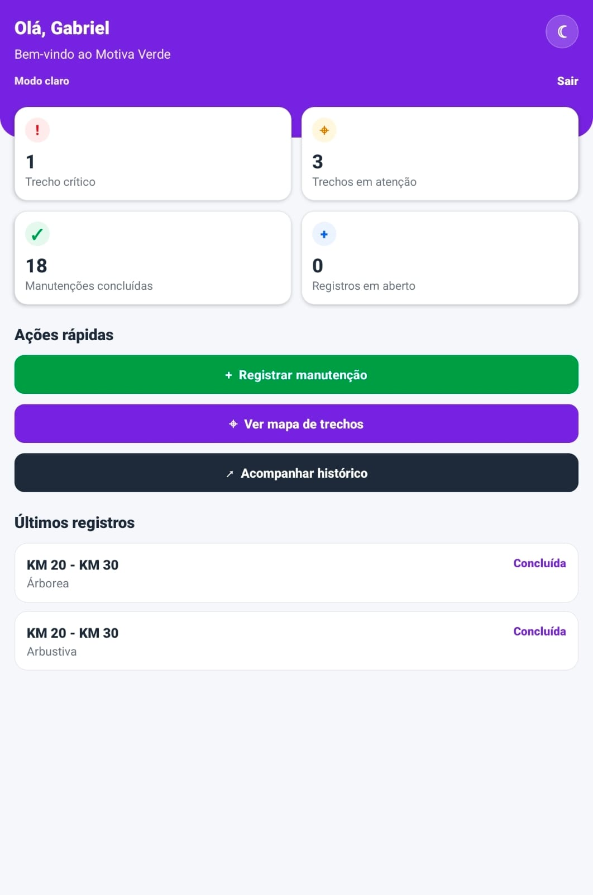
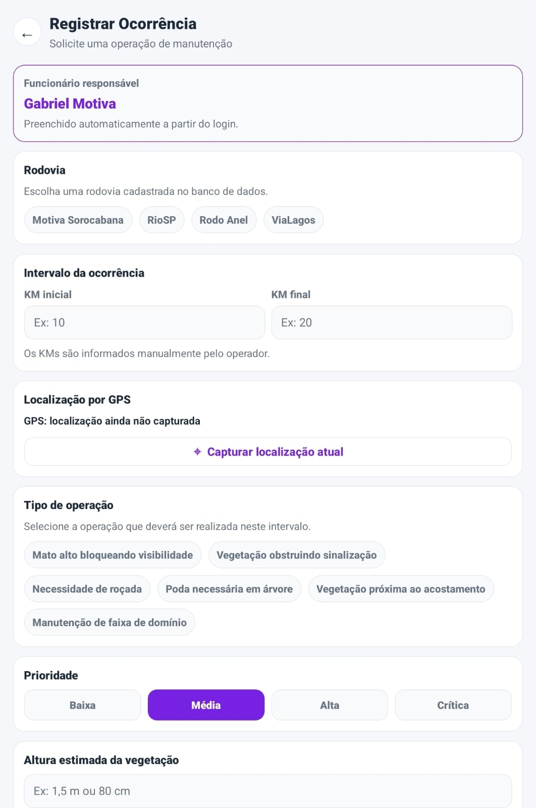
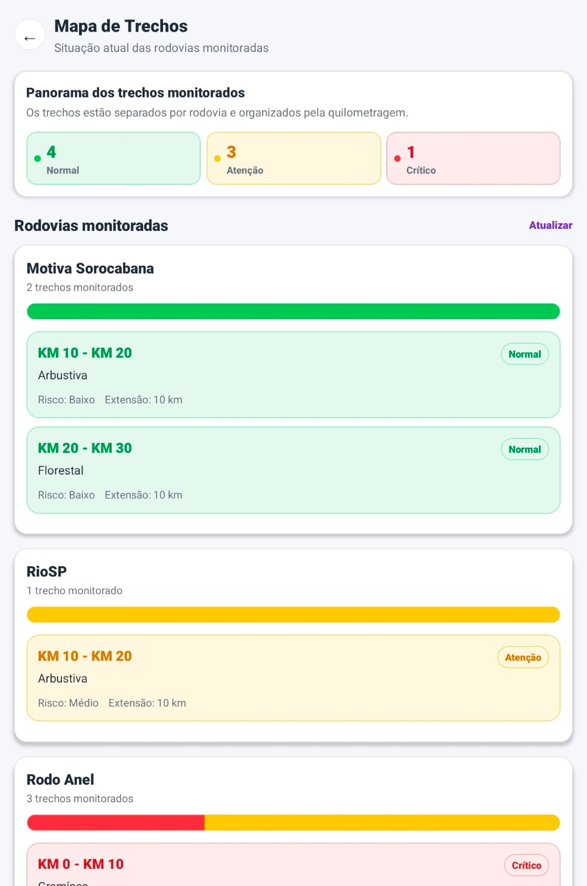
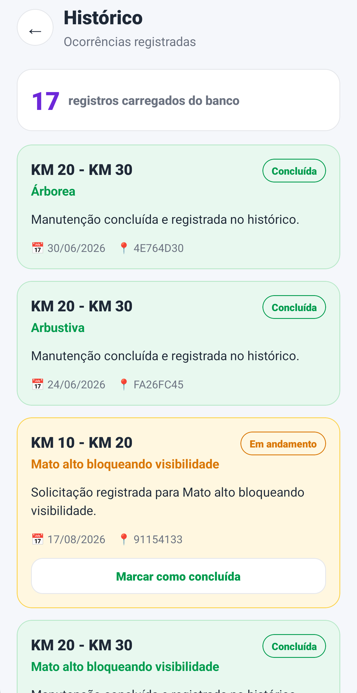

# 🌿 Motiva Verde

Aplicativo mobile desenvolvido para apoiar a **gestão, o registro e o acompanhamento de ocorrências de vegetação em trechos rodoviários da Motiva**.

Esta entrega corresponde à **Sprint 4 — Versão Final, APK e Plano de Negócio**, consolidando a evolução do projeto ao longo das quatro Sprints.

A versão final conta com aplicativo mobile desenvolvido em **React Native + Expo**, API REST em **Python + Flask**, banco de dados **Supabase/PostgreSQL**, backend publicado no **Render** e versão Android distribuída através de **APK instalável**.

---

## 🔗 Entregas e evolução do projeto

| Etapa | Entrega | Link |
| --- | --- | --- |
| Sprint 1 | Repositório GitHub | [Acessar Sprint 1](https://github.com/jalbino0/challenge-motiva-verde-sprint1) |
| Sprint 2 | Repositório GitHub | [Acessar Sprint 2](https://github.com/jalbino0/challenge-motiva-verde-sprint2) |
| Sprint 3 | Repositório GitHub | [Acessar Sprint 3](https://github.com/jalbino0/challenge-motiva-verde-sprint3) |
| Sprint 4 | Repositório final | [Acessar Sprint 4](https://github.com/jalbino0/challenge-motiva-verde-final) |
| Sprint 4 | APK Android — Release v1.0.0 | [Baixar APK](https://github.com/jalbino0/challenge-motiva-verde-final/releases/tag/v1.0.0) |
| Sprint 4 | Backend publicado no Render | [Acessar API](https://motiva-verde-api.onrender.com) |
| Sprint 4 | Vídeo final de pitch | **[LINK DO YOUTUBE NÃO LISTADO]** |

---

## 👥 Integrantes

| Nome | RM |
| --- | --- |
| Fernando Caires Silva | 563415 |
| Giovanna Fernandes Pereira | 565434 |
| Guilherme Martins Rezende | 563500 |
| João Pedro de Moura Albino | 565323 |
| Kauê Silva Matheus | 561675 |
| Raphael Mischiatti de Souza | 563567 |

---

# 🎯 Problema abordado

A gestão da vegetação ao longo das rodovias envolve atividades como roçada, poda, conservação da faixa de domínio e acompanhamento das condições dos trechos.

Um dos principais desafios é manter os registros de campo **atualizados, padronizados, centralizados e acessíveis**, permitindo que as equipes identifiquem rapidamente os locais que necessitam de intervenção.

Informações dispersas dificultam:

- o acompanhamento das ocorrências;
- a definição de prioridades;
- a identificação dos trechos mais críticos;
- a comunicação entre campo e gestão;
- a consulta ao histórico das intervenções.

O **Motiva Verde** foi desenvolvido para apoiar esse processo através de uma aplicação mobile voltada às equipes responsáveis pela operação e manutenção das rodovias.

---

# 💡 Proposta da solução

O Motiva Verde centraliza o registro e acompanhamento de ocorrências relacionadas à vegetação nas rodovias concessionadas.

Através do aplicativo, o funcionário pode:

- realizar login no sistema;
- visualizar indicadores operacionais;
- selecionar a rodovia relacionada à ocorrência;
- informar o intervalo de quilometragem;
- registrar o tipo de operação necessária;
- definir a prioridade;
- informar a altura estimada da vegetação;
- capturar a localização através de GPS;
- consultar os trechos monitorados;
- visualizar a classificação de risco;
- consultar registros e histórico;
- acompanhar informações persistidas no banco de dados.

A solução busca oferecer maior **rastreabilidade, organização e apoio à tomada de decisão** para as equipes responsáveis pela manutenção da vegetação.

---

# 🏗️ Arquitetura da solução

A versão final utiliza uma arquitetura dividida em três camadas:

```text
┌──────────────────────────────┐
│       Motiva Verde App       │
│     React Native + Expo      │
│         TypeScript           │
└──────────────┬───────────────┘
               │
               │ HTTP / JSON
               ▼
┌──────────────────────────────┐
│        API REST Flask        │
│      Backend no Render       │
└──────────────┬───────────────┘
               │
               │ Supabase API
               ▼
┌──────────────────────────────┐
│           Supabase           │
│      PostgreSQL Cloud        │
└──────────────────────────────┘
```

O aplicativo não acessa diretamente o banco de dados.

As requisições são enviadas para a **API Flask**, responsável pelo processamento e pela comunicação com o **Supabase**.

Na versão final da Sprint 4, a API está publicada no Render:

```text
https://motiva-verde-api.onrender.com
```

Com isso, o APK instalado no dispositivo Android pode acessar o backend remotamente, sem depender da execução de um servidor Flask local.

---

# ✅ Funcionalidades implementadas

## 🔐 Login do funcionário

A aplicação possui autenticação de funcionários com:

- campo de e-mail;
- campo de senha;
- validação do funcionário pelo backend;
- armazenamento da sessão;
- identificação do funcionário autenticado;
- mensagens de erro quando necessário.

O funcionário responsável por um registro é identificado automaticamente através da sessão de login.

---

## 📊 Dashboard

A tela inicial fornece uma visão geral das informações operacionais.

Entre os indicadores apresentados estão:

- **Trecho crítico**;
- **Trechos em atenção**;
- **Manutenções concluídas**;
- **Registros em aberto**.

Também existem ações rápidas para:

- registrar manutenção;
- consultar o Mapa de Trechos;
- acompanhar o histórico.

A tela também apresenta os registros mais recentes cadastrados no sistema.

---

## 📝 Registro de ocorrência

O funcionário pode registrar uma nova ocorrência informando diferentes dados relacionados à situação encontrada em campo.

### Funcionário responsável

O responsável pelo registro é preenchido automaticamente de acordo com o funcionário autenticado.

### Rodovia

Entre as rodovias disponíveis estão:

- Motiva Sorocabana;
- RioSP;
- Rodo Anel;
- ViaLagos.

### Intervalo

O funcionário informa:

- KM inicial;
- KM final.

### Localização

O aplicativo permite capturar a localização atual do dispositivo utilizando GPS.

### Tipo de operação

Entre as opções disponíveis estão:

- Mato alto bloqueando visibilidade;
- Vegetação obstruindo sinalização;
- Necessidade de roçada;
- Poda necessária em árvore;
- Vegetação próxima ao acostamento;
- Manutenção de faixa de domínio.

### Prioridade

A ocorrência pode ser classificada como:

- Baixa;
- Média;
- Alta;
- Crítica.

Também existe a possibilidade de informar a altura estimada da vegetação quando aplicável.

---

# 🛣️ Mapa de Trechos

> **Importante:** apesar do nome da tela, o Mapa de Trechos não representa um mapa geográfico.

A tela funciona como um **painel operacional de monitoramento dos trechos cadastrados no sistema**.

Na versão final, os dados são:

- agrupados por rodovia;
- organizados por quilometragem;
- carregados através do backend;
- classificados por risco;
- identificados como Normal, Atenção ou Crítico;
- acompanhados pela extensão correspondente.

A extensão de cada trecho é calculada através da diferença:

```text
KM final - KM inicial
```

Exemplo:

```text
KM 10 - KM 20
Extensão: 10 km
```

A separação por rodovia evita que intervalos semelhantes pertencentes a rodovias diferentes sejam apresentados de maneira confusa.

---

# 🗂️ Histórico

A tela de Histórico apresenta os registros armazenados no sistema.

Cada registro pode conter:

- intervalo de KM;
- tipo de vegetação ou operação;
- status;
- descrição;
- data;
- identificador.

O histórico permite manter a rastreabilidade das ocorrências e intervenções registradas ao longo do tempo.

---

# 📍 Localização por GPS

O aplicativo utiliza os recursos de localização do dispositivo para auxiliar no registro das ocorrências.

O fluxo contempla:

- solicitação de permissão de localização;
- captura de latitude;
- captura de longitude;
- tratamento de permissão negada;
- tratamento de falhas durante a obtenção da localização.

---

# 🌙 Tema claro e escuro

A aplicação possui suporte a:

- tema claro;
- tema escuro.

A preferência visual pode ser utilizada durante a navegação pelo aplicativo, mantendo a legibilidade das informações.

---

# 🔧 Correções e melhorias da Sprint 4

A Sprint 4 incorporou ajustes identificados durante os testes e revisão da versão anterior.

## 🔐 Login

### Problema identificado

O teclado virtual do Android poderia cobrir os campos de e-mail e senha durante o preenchimento.

### Correção

A tela de login foi ajustada utilizando:

- `KeyboardAvoidingView`;
- `ScrollView`;
- ajustes de comportamento e posicionamento da interface.

Após a alteração, os campos permanecem acessíveis mesmo com o teclado aberto.

---

## 🛣️ Mapa de Trechos

### Problemas identificados

- trechos pertencentes a rodovias diferentes apareciam misturados;
- intervalos de KM semelhantes poderiam causar confusão;
- o cálculo e a apresentação da extensão precisavam ser padronizados.

### Correções

Foram implementados:

- agrupamento por rodovia;
- organização por quilometragem;
- melhor separação visual dos trechos;
- classificação de risco;
- cálculo correto da extensão.

A extensão passou a seguir:

```text
KM final - KM inicial
```

---

## 📊 Dashboard

Os indicadores e informações apresentados no Dashboard foram revisados para manter consistência com os registros e os dados exibidos no Mapa de Trechos.

---

## 🎨 Identidade visual

A apresentação visual também passou por uma revisão final.

Foram atualizados:

- logo;
- ícone do aplicativo;
- adaptive icon Android;
- splash screen;
- tela inicial.

Também foi corrigido um problema anterior em que o símbolo poderia aparecer com um fundo branco indesejado.

---

## ☁️ Backend remoto

Durante etapas anteriores do projeto, o desenvolvimento utilizava uma API Flask executada localmente.

Na Sprint 4, o backend foi publicado no **Render**.

O fluxo oficial da versão final passou a ser:

```text
Aplicativo Android
        ↓
API Flask no Render
        ↓
Supabase / PostgreSQL
```

Isso permite que a aplicação instalada seja utilizada sem a necessidade de manter um computador executando o servidor Flask localmente.

---

# 📱 Telas da versão final

As imagens abaixo representam a versão final do Motiva Verde utilizada na Sprint 4.

<table>
  <tr>
    <td align="center">
      <strong>Login</strong><br>
      
    </td>
    <td align="center">
      <strong>Dashboard</strong><br>
      
    </td>
  </tr>

  <tr>
    <td align="center">
      <strong>Registrar ocorrência</strong><br>
      
    </td>
    <td align="center">
      <strong>Mapa de Trechos</strong><br>
      
    </td>
  </tr>

  <tr>
    <td colspan="2" align="center">
      <strong>Histórico</strong><br>
      
    </td>
  </tr>
</table>

---

# 🔄 Fluxo principal da aplicação

```text
Login do funcionário
        ↓
Validação pelo backend
        ↓
Dashboard
        ↓
Consulta das informações operacionais
        ↓
Registrar ocorrência
        ↓
Selecionar rodovia
        ↓
Informar KM inicial e KM final
        ↓
Selecionar operação e prioridade
        ↓
Capturar localização GPS
        ↓
Enviar os dados para a API Flask
        ↓
Persistência no Supabase
        ↓
Consulta das informações
        ↓
Histórico / Mapa de Trechos
```

---

# 🗄️ Banco de dados

O projeto utiliza **Supabase com PostgreSQL**.

As principais tabelas utilizadas são:

| Tabela | Responsabilidade |
| --- | --- |
| `Funcionarios` | Dados utilizados para identificação e autenticação dos funcionários |
| `Rodovias` | Trechos monitorados e informações relacionadas às rodovias |
| `Solicitacoes` | Ocorrências e solicitações registradas |
| `Historico` | Histórico de registros e manutenções |

O acesso aos dados é centralizado pelo backend Flask, mantendo a lógica de comunicação com o banco fora das telas do aplicativo.

---

# 🧰 Tecnologias utilizadas

## 📱 Mobile

- React Native
- Expo
- Expo Router
- TypeScript
- AsyncStorage
- Expo Location
- React Native Safe Area Context

## ⚙️ Backend

- Python 3
- Flask
- Flask-CORS
- Supabase Python Client
- python-dotenv
- API REST

## 🗄️ Banco de dados

- Supabase
- PostgreSQL

## ☁️ Infraestrutura

- Render
- Supabase Cloud
- GitHub
- GitHub Releases
- Expo EAS Build

## 📦 Distribuição

- Android APK

---

# 📁 Estrutura do projeto

```text
challenge-motiva-verde-final/
│
├── app/
│   ├── _layout.tsx
│   ├── index.tsx
│   ├── dashboard.tsx
│   ├── registrar.tsx
│   ├── mapa.tsx
│   └── historico.tsx
│
├── assets/
│   ├── images/
│   ├── screens/
│   │   ├── dashboard.png
│   │   ├── entrada.png
│   │   ├── historico.png
│   │   ├── mapa.png
│   │   └── registrar.png
│   └── logo-simbolo.png
│
├── backend/
│   ├── app.py
│   ├── requirements.txt
│   ├── .env.example
│   └── migration_campos_app.sql
│
├── src/
│   ├── components/
│   ├── context/
│   ├── data/
│   ├── services/
│   └── styles/
│
├── .env.example
├── .gitignore
├── app.json
├── eas.json
├── package.json
├── package-lock.json
├── TESTES.md
├── tsconfig.json
└── README.md
```

---

# ⚙️ Como executar em ambiente de desenvolvimento

A versão distribuída através do APK utiliza o backend remoto publicado no Render.

## Pré-requisitos

Para executar o código-fonte em ambiente de desenvolvimento são necessários:

- Node.js;
- npm;
- Expo;
- Android Studio com emulador Android ou dispositivo Android compatível.

---

## 1. Clonar o repositório

```bash
git clone https://github.com/jalbino0/challenge-motiva-verde-final.git
```

Entre na pasta:

```bash
cd challenge-motiva-verde-final
```

---

## 2. Instalar as dependências

```bash
npm install
```

---

## 3. Configurar a URL da API

A versão final utiliza:

```env
EXPO_PUBLIC_API_URL=https://motiva-verde-api.onrender.com
```

As credenciais privadas do banco de dados não devem ser publicadas no repositório.

---

## 4. Iniciar o projeto

```bash
npx expo start -c
```

Com um emulador ou dispositivo Android disponível, o aplicativo pode ser iniciado através das opções apresentadas pelo Expo.

---

# 🌐 Backend publicado

A API oficial utilizada pela versão final está disponível em:

```text
https://motiva-verde-api.onrender.com
```

O endpoint de verificação utilizado é:

```text
/health
```

A publicação remota elimina a necessidade de manter o Flask executando localmente durante a utilização normal do APK.

---

# 📦 APK Android

A versão final do aplicativo foi gerada utilizando **Expo EAS Build**.

O perfil de build Android foi configurado para gerar um arquivo:

```text
.apk
```

O APK final foi instalado e testado em dispositivo Android.

## 📥 Download

A versão oficial está disponível através da Release:

### Motiva Verde v1.0.0

https://github.com/jalbino0/challenge-motiva-verde-final/releases/tag/v1.0.0

---

# 📲 Como instalar o APK

1. Acesse a página da Release `v1.0.0`.

2. Localize a seção **Assets**.

3. Faça o download do arquivo `.apk`.

4. Abra o arquivo no dispositivo Android.

5. Caso o sistema solicite autorização, permita a instalação de aplicativos provenientes da fonte utilizada para o download.

6. Confirme a instalação.

7. Abra o aplicativo **Motiva Verde**.

> O APK é disponibilizado através do GitHub Releases e não é armazenado diretamente no histórico principal do repositório.

---

# 🧪 Testes

Durante a Sprint 3, os principais fluxos da aplicação foram documentados através de testes manuais.

Foram avaliados cenários relacionados a:

- autenticação;
- carregamento do Dashboard;
- registro de ocorrência;
- consulta dos trechos monitorados;
- histórico;
- GPS;
- tema claro e escuro;
- comunicação com o backend;
- comportamento em cenários de erro.

O documento pode ser consultado em:

```text
TESTES.md
```

Durante a Sprint 4, também foram realizados os testes finais da aplicação e do APK Android gerado através do Expo EAS Build.

---

# 📌 Status final das funcionalidades

| Funcionalidade | Status |
| --- | --- |
| Login de funcionário | ✅ Concluído |
| Persistência da sessão | ✅ Concluído |
| Dashboard | ✅ Concluído |
| Indicadores operacionais | ✅ Concluído |
| Consulta de rodovias | ✅ Concluído |
| Registro de ocorrência | ✅ Concluído |
| Validação do formulário | ✅ Concluído |
| Intervalo de quilometragem | ✅ Concluído |
| Captura de GPS | ✅ Concluído |
| Definição de prioridade | ✅ Concluído |
| Seleção do tipo de operação | ✅ Concluído |
| Mapa de Trechos | ✅ Concluído |
| Organização por rodovia | ✅ Concluído |
| Cálculo de extensão | ✅ Concluído |
| Classificação Normal / Atenção / Crítico | ✅ Concluído |
| Histórico | ✅ Concluído |
| Tema claro/escuro | ✅ Concluído |
| Integração Flask + Supabase | ✅ Concluído |
| Backend publicado no Render | ✅ Concluído |
| Build Android | ✅ Concluído |
| APK instalado e validado | ✅ Concluído |
| Release v1.0.0 | ✅ Concluído |
| Plano de negócio | ✅ Concluído |

---

# 💼 Plano de Negócio

## 💡 Proposta de valor

O Motiva Verde oferece uma solução centralizada para registrar, organizar e acompanhar ocorrências relacionadas à vegetação em rodovias.

Cada ocorrência pode ser relacionada a informações como:

- rodovia;
- intervalo de quilometragem;
- localização;
- tipo de operação;
- prioridade;
- classificação de risco;
- histórico.

A centralização das informações permite maior rastreabilidade e facilita a priorização das atividades realizadas pelas equipes responsáveis pela manutenção.

---

# 🎯 Público-alvo

A solução possui foco **B2B**, sendo direcionada principalmente a empresas responsáveis pela concessão, operação e manutenção de rodovias.

No contexto deste projeto, o principal cliente seria a **Motiva**.

### Usuários diretos

- funcionários de campo;
- equipes de conservação;
- equipes de manutenção;
- operadores responsáveis pelo registro das ocorrências.

### Usuários de gestão

- supervisores;
- coordenadores;
- gestores de operações;
- responsáveis pelo planejamento das intervenções.

---

# 👤 Personas

## Persona 1 — Operador de campo

Profissional responsável por percorrer os trechos rodoviários e identificar situações que exigem manutenção.

### Necessidades

- registrar rapidamente uma ocorrência;
- identificar a rodovia;
- informar a quilometragem;
- registrar localização;
- definir prioridade;
- utilizar o sistema diretamente pelo celular.

### Valor entregue

O Motiva Verde reduz a dependência de registros dispersos e permite centralizar as informações diretamente no sistema.

---

## Persona 2 — Supervisor de manutenção

Profissional responsável por acompanhar as ocorrências e organizar as prioridades das equipes.

### Necessidades

- identificar trechos que exigem atenção;
- encontrar ocorrências críticas;
- visualizar prioridades;
- consultar registros;
- acompanhar diferentes rodovias.

### Valor entregue

O Motiva Verde fornece maior visibilidade operacional e auxilia na priorização das atividades.

---

## Persona 3 — Gestor operacional

Profissional responsável pelo acompanhamento geral da operação.

### Necessidades

- rastreabilidade das ocorrências;
- histórico das intervenções;
- visão consolidada dos dados;
- apoio ao planejamento;
- organização das informações.

### Valor entregue

A plataforma centraliza os dados operacionais e cria uma base que pode futuramente alimentar indicadores e relatórios gerenciais.

---

# 💰 Modelo de receita

Por se tratar de uma solução empresarial, o modelo proposto é **B2B SaaS com licença corporativa**.

A empresa contratante pagaria pela utilização da plataforma juntamente com serviços de infraestrutura, manutenção e suporte.

## Implantação inicial

A implantação poderia incluir:

- configuração do ambiente;
- cadastramento e parametrização das rodovias;
- configuração da infraestrutura;
- treinamento inicial;
- customizações necessárias.

### Estimativa acadêmica

**R$ 15.000 a R$ 30.000 por implantação.**

---

## Licença corporativa mensal

A licença poderia incluir:

- acesso à plataforma;
- infraestrutura;
- backend;
- banco de dados;
- atualizações;
- monitoramento;
- manutenção corretiva;
- suporte.

### Estimativa acadêmica

**R$ 5.000 a R$ 10.000 por mês.**

O valor poderia variar conforme:

- número de usuários;
- quantidade de concessionárias;
- volume de registros;
- armazenamento utilizado;
- nível de suporte;
- SLA;
- integrações com sistemas corporativos.

> Os valores apresentados são estimativas acadêmicas para demonstração da viabilidade do modelo de negócio e não representam uma proposta comercial oficial.

---

# 💵 Estimativa de custos operacionais

Em um cenário inicial de operação, os principais custos poderiam ser:

| Categoria | Estimativa mensal |
| --- | ---: |
| Hospedagem da API e infraestrutura | R$ 150 – R$ 400 |
| Banco de dados e armazenamento | R$ 150 – R$ 400 |
| Monitoramento, logs e backups | R$ 100 – R$ 300 |
| Suporte operacional | R$ 800 – R$ 2.000 |
| Manutenção e evolução do software | R$ 2.000 – R$ 5.000 |
| **Total estimado** | **R$ 3.200 – R$ 8.100/mês** |

Esses valores representam uma estimativa para um ambiente inicial.

Em uma implantação corporativa real, os custos dependeriam do número de usuários, quantidade de dados, disponibilidade exigida, integrações e nível de suporte contratado.

---

# ⭐ Diferenciais competitivos

O Motiva Verde foi desenvolvido especificamente para o contexto de acompanhamento de vegetação em rodovias.

Entre seus principais diferenciais estão:

- organização por rodovia;
- identificação por intervalo de KM;
- captura de localização GPS;
- definição de prioridade;
- classificação de risco;
- acompanhamento dos trechos;
- histórico centralizado;
- aplicativo mobile para uso em campo;
- integração entre aplicativo, API e banco de dados;
- dados persistidos em ambiente remoto;
- backend independente do dispositivo;
- possibilidade de expansão para outras concessionárias;
- possibilidade de evolução para ferramentas gerenciais.

---

# ⚠️ Principais riscos

## 📡 Conectividade em campo

Alguns trechos rodoviários podem apresentar cobertura de internet limitada.

### Mitigação futura

Implementação de funcionamento offline, permitindo armazenar temporariamente os registros e sincronizá-los posteriormente.

---

## ☁️ Disponibilidade da infraestrutura

Indisponibilidades da API ou do banco podem temporariamente impedir algumas operações.

### Mitigação

- monitoramento;
- tratamento de timeout;
- políticas de retry;
- backups;
- infraestrutura compatível com a criticidade do serviço.

---

## 📝 Qualidade das informações

Dados preenchidos de maneira incorreta podem reduzir a qualidade dos registros.

### Mitigação

- validações de formulário;
- campos estruturados;
- opções pré-definidas;
- treinamento dos funcionários.

---

## 🔒 Segurança

Uma implantação corporativa exige mecanismos adequados de autenticação e controle de acesso.

### Mitigação futura

- autenticação corporativa;
- perfis de usuário;
- diferentes níveis de acesso;
- auditoria;
- revisão periódica das credenciais;
- políticas de segurança.

---

## 👥 Adoção pelos usuários

A adoção de uma nova solução depende da adaptação das equipes.

### Mitigação

- interface simples;
- treinamento;
- implantação gradual;
- suporte inicial.

---

# 📈 Impacto esperado para a Motiva

A utilização do Motiva Verde pode contribuir para:

- maior rastreabilidade das ocorrências;
- centralização das informações;
- redução de registros dispersos;
- melhoria da organização operacional;
- melhor acompanhamento das equipes;
- identificação dos trechos prioritários;
- histórico das intervenções;
- apoio à tomada de decisão;
- melhor comunicação entre campo e gestão.

Além dos ganhos operacionais, o acompanhamento organizado da vegetação pode contribuir para a **segurança viária**, especialmente em situações em que a vegetação interfere na visibilidade, sinalização ou acostamento.

---

# 🔮 Possibilidades de evolução

O projeto permite futuras expansões, como:

- funcionamento offline;
- sincronização automática;
- armazenamento de imagens em nuvem;
- dashboards gerenciais;
- relatórios operacionais;
- notificações;
- indicadores por rodovia;
- indicadores por concessionária;
- autenticação corporativa;
- perfis e níveis de acesso;
- integração com outros sistemas da empresa;
- análise histórica dos trechos;
- mecanismos de priorização baseados em dados.

---

# 🚀 Evolução por Sprint

## Sprint 1 — Protótipo e concepção

A Sprint 1 foi dedicada à definição da proposta inicial do Motiva Verde, organização dos fluxos e desenvolvimento do protótipo da solução.

Repositório:

https://github.com/jalbino0/challenge-motiva-verde-sprint1

---

## Sprint 2 — Aplicação funcional

Na Sprint 2, o protótipo começou a ser transformado em uma aplicação mobile utilizando **React Native e Expo**.

Foram estruturadas as principais telas, navegação e componentes da aplicação.

Repositório:

https://github.com/jalbino0/challenge-motiva-verde-sprint2

---

## Sprint 3 — Protótipo funcional completo

Na Sprint 3, a solução foi consolidada com integração entre:

```text
React Native / Expo
        ↓
Flask
        ↓
Supabase
```

Foram implementados e aperfeiçoados:

- login;
- Dashboard;
- registro de ocorrências;
- GPS;
- consulta de rodovias;
- histórico;
- integração com banco de dados;
- estados vazios;
- tratamento de erros;
- melhorias de legibilidade;
- tema claro e escuro;
- testes manuais.

Também foi criado o documento `TESTES.md`, contendo os testes realizados e os pontos identificados para evolução.

Repositório:

https://github.com/jalbino0/challenge-motiva-verde-sprint3

---

## Sprint 4 — Versão Final, APK e Plano de Negócio

Na Sprint 4, foram realizados os ajustes necessários para consolidar a versão final do Motiva Verde.

Entre as principais entregas estão:

- correções identificadas após os testes da Sprint 3;
- correção do comportamento do teclado no login;
- reorganização do Mapa de Trechos;
- separação dos dados por rodovia;
- correção do cálculo de extensão;
- revisão dos indicadores do Dashboard;
- revisão da identidade visual;
- publicação do backend no Render;
- utilização do Supabase como banco remoto;
- configuração do Expo EAS Build;
- geração do APK Android;
- instalação e validação do APK;
- publicação da Release `v1.0.0`;
- consolidação da documentação;
- elaboração do plano de negócio;
- preparação do vídeo final de pitch e demonstração.

Repositório final:

https://github.com/jalbino0/challenge-motiva-verde-final

---

# 📱 Decisão tecnológica

O Motiva Verde permaneceu utilizando **React Native com Expo** durante o desenvolvimento.

Não houve migração para Flutter.

A decisão permitiu preservar a base funcional desenvolvida nas etapas anteriores e concentrar os esforços da Sprint 4 nas correções, infraestrutura, integração, geração do APK e preparação da versão final.

---

# 🔒 Segurança

Arquivos contendo credenciais reais não devem ser publicados no GitHub.

O projeto utiliza arquivos de exemplo para indicar as variáveis necessárias, enquanto informações sensíveis devem permanecer configuradas através de variáveis de ambiente.

Entre as práticas utilizadas estão:

- não versionar arquivos `.env` com credenciais reais;
- utilização de `.gitignore`;
- separação entre aplicativo e acesso ao banco;
- comunicação através da API Flask;
- utilização de variáveis de ambiente.

Em uma implantação corporativa real também seriam recomendadas políticas adicionais de autenticação, autorização, auditoria e gerenciamento de credenciais.

---

# 🎥 Vídeo final de pitch e demonstração

O vídeo final da Sprint 4 possui duração máxima de **5 minutos** e apresenta:

1. os integrantes do grupo;
2. o problema abordado;
3. a proposta do Motiva Verde;
4. o aplicativo instalado em dispositivo Android;
5. login;
6. Dashboard;
7. Mapa de Trechos;
8. registro de ocorrência;
9. seleção da rodovia;
10. KM inicial e final;
11. captura de localização;
12. prioridade e tipo de operação;
13. Histórico;
14. plano de negócio resumido;
15. impacto esperado para a Motiva.

O vídeo é apresentado pelos próprios integrantes do grupo.

### 🎬 Vídeo no YouTube

**[LINK DO YOUTUBE NÃO LISTADO]**

---

# ✅ Situação final do projeto

A Sprint 4 consolida o **Motiva Verde v1.0.0** como versão final do projeto.

A arquitetura final utiliza:

```text
Aplicativo React Native + Expo
             ↓
       API Flask / Render
             ↓
     Supabase / PostgreSQL
```

A aplicação possui um **APK Android gerado através do Expo EAS Build, instalado e validado em dispositivo Android**.

A solução demonstra a evolução de uma proposta inicial para uma aplicação mobile integrada, com:

- interface funcional;
- comunicação com backend;
- persistência de dados;
- infraestrutura remota;
- distribuição através de APK;
- documentação consolidada;
- plano de negócio;
- proposta de aplicação no contexto operacional da Motiva.

---

# 🌿 Motiva Verde

### Monitoramento de vegetação em rodovias de forma centralizada, rastreável e orientada à operação.
